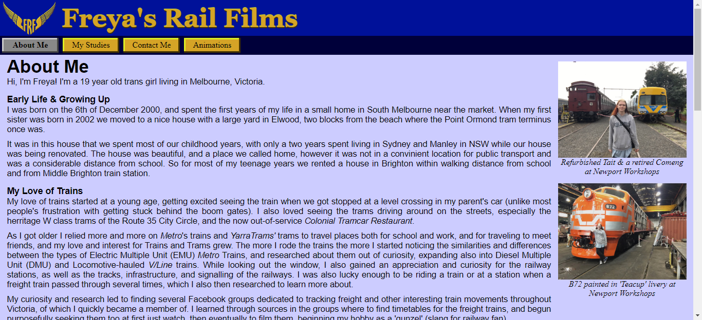
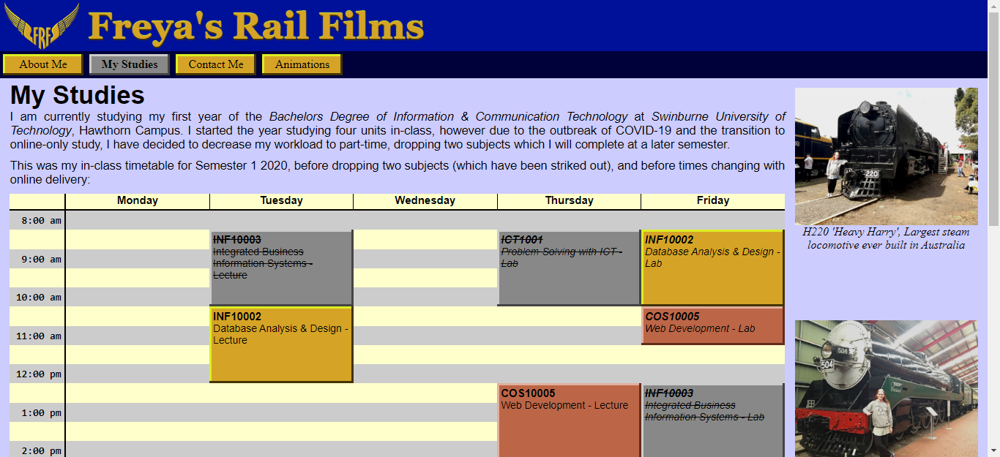
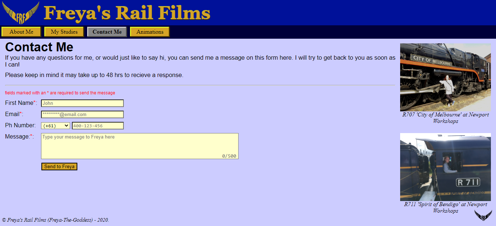
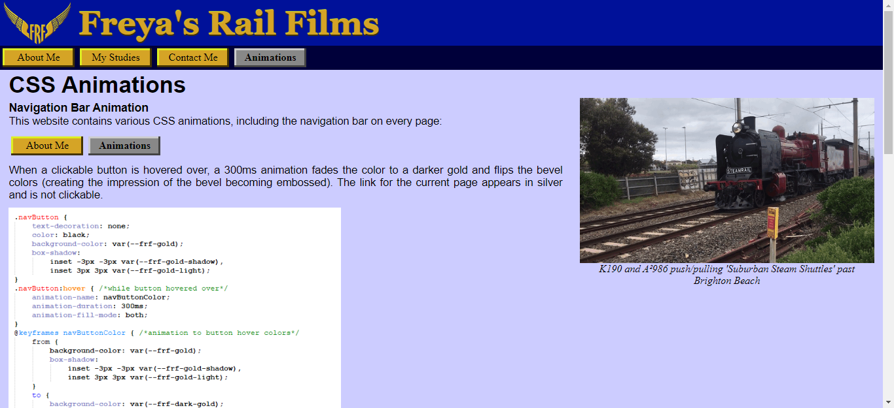
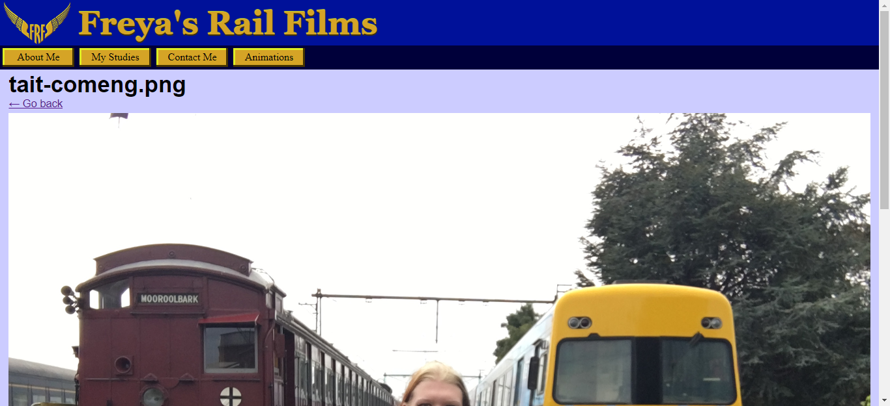
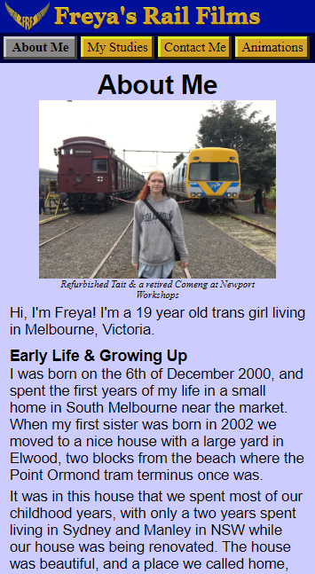
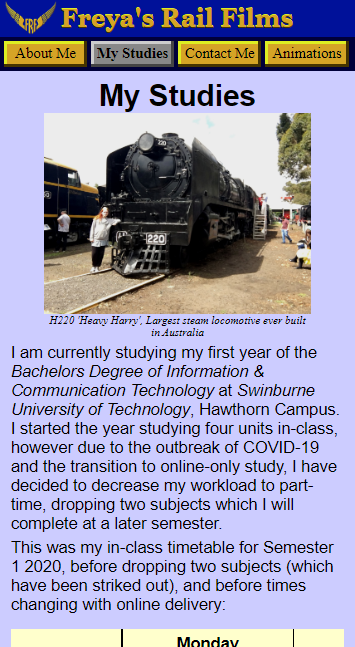
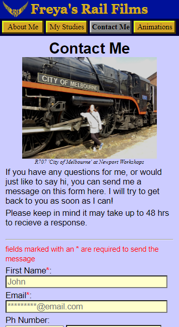
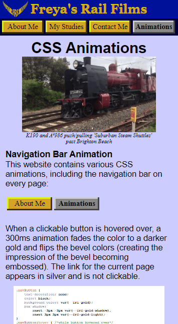
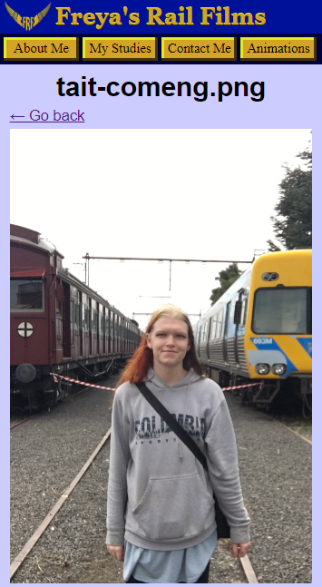

# Freya's Personal Website
**Created by Freya-The-Goddess** 
*Personal Website project for Web Development (COS10005)* 
*Swinburne University - Semester 1 2020*

## Project Summary
This project was the first major assignment for Web Development which I studied at Swinburne in Semester 1 of 2020. 
The assignment was to create a personal website using HTML, CSS and JavaScript. 
Certain HTML elements were required for the assignment including images, a table, and a form.
CSS styles for the site are created following mobile-first principles to allow better combatibility and faster loading times on smaller screens. 

## About Me (index) Page
The "About Me" page is the home (index) page of the website and contains a short biography of my life and interests. 
Paragraphs and sections are used to organise the information on the page and images are included in a column to the right of the screen. 
On mobile devices and narrow browser windows images appear in-line with the content instead of in a separate column. 
   

## My Studies Page
The "My Studies" page was required for the assignment and includes my study timetable (at the time) created using a HTML table. 
It also includes a breif summary of my ICT education history including highschool and university. 
   

## Contact Me Page
The "Contact Me" page contains a HTML form for sending a message to the site creator (me). 
When the submit button is clicked a PHP server-side script handles the inputs and saves them to a new row of a CSV file. 
This was just a placeholder as PHP was beyond the scope of the class, proper handling of personal data would be to encrypt it and put it into a secure database. 
   

## Animations Page
The "Animations" page was required for the assignment and discusses how and where CSS animations have been implemented in the site. 
This includes the animations for clickable buttons and popups in the "My Studies" timetable.
   

## Image Page
When any image on the site is clicked it opens the "Image" page to view the photo larger. 
This is done by putting the image filename and ref page as URL arguements, which JavaScript uses to dynamically load the correct image into the page 
as well as setting the "Go Back" link to the previous page. 
   

## Mobile Screenshots

## Copyright and Licenses
***Copyright © - 2022 Freya-The-Goddess*** 
*All code, scripts and documentation in this software are licensed under the [MIT License](https://choosealicense.com/licenses/mit/).*

***CC BY - 2022 Freya-The-Goddess*** 
*All assets in this software (files in [/images](/images/) folder) unless noted otherwise are licensed under the [Creative Commons Attribution 4.0 International Public License](https://creativecommons.org/licenses/by/4.0/).*